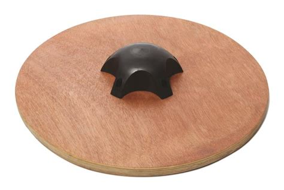

# Wobble Board with 3D Printed Dome

This wobble board is designed for easy fabrication at home, with an FDM printer and a jigsaw.

So far, I have built two wobble boards: the first one is approximately 19" across, with the dome `./shapes/wobble-dome.stl`, and the second one is approximately 21" across with the dome `./shapes/wobble-dome-35.stl`. The first board is very challenging, maybe dangerous. The second board has mild enough dynamics for my mother to use.

The first dome is a half-sphere, which makes for an inherently unstable platform, because the center of the sphere that you roll on is below your feet, on the bottom of the board. The second dome, `wobble-dome-35.stl`, has its center above the board, between your feet, making it much easier to control.

I recommend that everyone print `wobble-dome-35.stl` first, and aim to build a roughly 20" diameter platform. The upper surface should be grippy even with socks on, a cheap cuttable doormat might be a better choice than the foam pads that I've been using.

The highly unstable `wobble-dome.stl` might be fun for people who already have a normal wobble board or for surfers. For that one, I would not recommend a board less than 20" across. With my 19" board, I immediately slide off of it when it tilts all the way.

## Build Instructions

1. Slice and print one of the STL files, `./shapes/wobble-dome-35.stl` is a good default choice. My Slic3r config is in `./config.ini`. I used a 0.6mm nozzle with 5 wall layers each 1mm wide, 0.2mm tall. 6 top layers, 0 bottom layers. A 18% honeycomb infill provided adequate support for the awkward upper layers of the dome, and probably contributes to the overall rigidity.
	I used 1 1/4" screws to secure the domes, five are needed.

2. While that's printing, mark out a scrap or a sheet of plywood for the board. IMO, the board needs to be at least 3/4" thick to support an adult, and it must be plywood. I used scrap plywood that I obtained from the demolition of some custom cabinetry during a family member's renovation years ago. Definitely glad I kept and stored that now.
	The simplest board shape to draw is a circle. Mark the center of the board, put a screw at that point, tie a string to the screw. Measure out the desired radius of the board on the string, and tie a loop to hold a pencil at that distance. Hold the pencil as vertical as possible while tracing a circle against the string.
	Draw another circle with a radius to match that of the printed dome, so that the dome can be centered even when it obscures the center point. Alternatively, you could print just the first two layers and use that as a template to trace the position of the dome.

3. Use a jigsaw to cut the circle out. Consider rough sanding the lower edges to round them where the board strikes the ground. I didn't clear-coat or paint the exposed surface of the board, because the coating might get mashed into the carpet.

4. Glue a mat or foam pad to the upper surface of the board, then lay it on the floor to dry, top down. On the bottom side of the board, stack up some weights to press evenly across whole glued surface. Wait for the glue to set, then trim the mat to the edge of the board with a razor.

5. Flip the board and center the dome on the bottom surface. Put one screw in loose, then recenter as much as possible, then put in the rest of the scews. Tighten all of them carefully.

6. You're done! Try out your board on a soft surface. If you have enough material left over, consider making a wobble board for a friend :)

## Development

`./wobble-dome.scad` is a work in progress and is not at all paramtric, it needs lots of hacking to usefully customize the dome. If you want a parametric wobble dome generator, this is probably only usefull as an example.

Tasks remaining for a true parametric wobble board generator:

- Expose an interface for describing the dome using parameters that are relevant to the user: `dome_base_radius` determined by the build volume of the user's printer, `dome_height` determined by how far the board should be able to tip for a given board radius, and `dome_min_radius` to control the stability/instability of the board.
- Scale the curve parameters of the sidewall parabolas based on the dome parameters.
- Add a parameter `screw_height` to give the user a better opportunity to reuse their stashed hardware.
